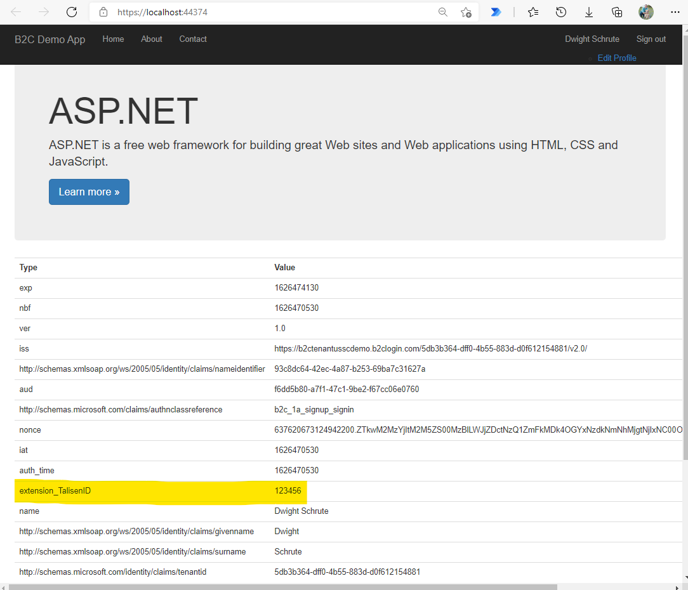

# Azure AD B2C with custom claim & ASP<area>.NET Framework MVC app

This repo includes a sample application & B2C tenant with custom policy to show how to store a custom claim on the user's profile & generate this unique ID the first time a user logs in.

## Disclaimer

**THE SOFTWARE IS PROVIDED "AS IS", WITHOUT WARRANTY OF ANY KIND, EXPRESS OR IMPLIED, INCLUDING BUT NOT LIMITED TO THE WARRANTIES OF MERCHANTABILITY, FITNESS FOR A PARTICULAR PURPOSE AND NONINFRINGEMENT. IN NO EVENT SHALL THE AUTHORS OR COPYRIGHT HOLDERS BE LIABLE FOR ANY CLAIM, DAMAGES OR OTHER LIABILITY, WHETHER IN AN ACTION OF CONTRACT, TORT OR OTHERWISE, ARISING FROM, OUT OF OR IN CONNECTION WITH THE SOFTWARE OR THE USE OR OTHER DEALINGS IN THE SOFTWARE.**

## Architecture


In this example, the backend ASP<area>.NET Framework MVC application expects a **custom claim** to show up to authorize the incoming user. This is a custom claim that was provided by a different identity provider and is used for all authorization on the backend (it uniquely identifies the incoming user). In this case, the backend applications can be only minimally changed, so this custom claim needs to show up in the OpenIDConnect ID token provided by the identity provider.

We can stand up an [Azure B2C tenant](https://docs.microsoft.com/en-us/azure/active-directory-b2c/) to support this. Azure AD B2C allows us to customize the signin experience for the users, support local & social accounts and work in any Azure environment (such as Government cloud).

We need to create a [custom B2C user policy](https://docs.microsoft.com/en-us/azure/active-directory-b2c/custom-policy-overview) that will guide the user through the sign up/sign in process. They will either create a new account if they don't already have one or sign in with their existing account. If they are signing up for the first time, we need to generate the **custom claim** (in this example, it is called the TalisenID to emulate the previous identity provider). We can use an [Azure Function](https://docs.microsoft.com/en-us/azure/azure-functions/) as an inexpensive & always available HTTP call to generate this ID for new users. Once it has been generated, it will always be stored on the user's profile in Azure AD B2C.

We also want to scan all incoming traffic to the backend applications for potential attacks, so we can direct traffic through an [Azure Application Gateway](https://docs.microsoft.com/en-us/azure/application-gateway/overview) with [Web Application Firewall (WAF)](https://docs.microsoft.com/en-us/azure/web-application-firewall/).

[Azure Application Insights](https://docs.microsoft.com/en-us/azure/azure-monitor/app/app-insights-overview) can be linked up to your policies to track usage & debug errors in the user journey.

Additionally, we can **back-populate** all existing users from the original identity provider using the [Microsoft Graph API](https://docs.microsoft.com/en-us/graph/) & our B2C tenant.

Finally, the demo web app will display the all the ID token (using [hybrid flow](https://docs.microsoft.com/en-us/azure/active-directory/develop/v2-protocols-oidc)) claims as key/value pairs in a table to show the fact that the custom claims comes through. The application can then use this claim to make authorization decisions on a per-user basis.



## Structure

The repo is divided into 2 sections.

- **b2c-custom-policy** : The custom B2C policy you will need to upload to an Azure AD B2C tenant
- **DemoWebAppB2CWithCustomClaim** : A dummy ASP.NET Framework MVC app that will redirect the user to sign up/sign in with Azure AD B2C and print the ID token that is received from the identity provider to show the custom claim come through.

## Deployment process

## Azure setup

### Create the Application Insights resource

You will use Azure Application Insights to track usage & debug errors in the user journeys. You will need to copy the **InstrumentationKey** Guid from the **Overview** blade after deployment so you can add it to the custom B2C policies.

### Create Azure Function resource and add code to generate custom claim for each user

Create an Azure Function (Consumption Serverless SKU) to generate the custom claim for new user sign-up.

In this example, I will use a PowerShell function.

Create a new function in the **Functions** blade.

1. Create a new function called **GenerateTalisenID**.
1. Make it an HTTP triggered function that runs PowerShell.
1. In the **Code + Test** blade of that newly created function, add the following code. Notice that the "result" is a JSON object with the exact same name of the custom claim we want added to the user profile.

```powershell
using namespace System.Net

# Input bindings are passed in via param block.
param($Request, $TriggerMetadata)

# Write to the Azure Functions log stream.
Write-Host "PowerShell HTTP trigger function processed a request."

$result = @{
    extension_TalisenID = (New-Guid).Guid
}

$body = $result | ConvertTo-Json

# Associate values to output bindings by calling 'Push-OutputBinding'.
Push-OutputBinding -Name Response -Value ([HttpResponseContext]@{
    StatusCode = [HttpStatusCode]::OK
    Body = $body
})
```

### Create Azure AD B2C tenant

Create an Azure AD B2C tenant in your subscription & resource group. Once created, click on the **Overview->Azure AD B2C Settings...** button.

### Create application registrations to demo web app & back-population script

You will need to create 2 app registrations.

1. DemoWebApp - this is the identity for your Demo Web Application
1. Postman - this is the identity you can use for back-populating the B2C tenant with existing users

#### DemoWebApp

1. Create an app registration called "DemoWebApp"
1. Set the **Redirect URI** to "https://localhost:44374" so you can run the demo. You can also add "https://jwt.ms" after creation so you can have it send tokens to be decoded to debug if necessary. In a production environment, this would be the URL of your application.
1. Accept both the **openid** and **offline_access** scopes on the Microsoft Graph API
1. Set the **Supported account types** to "Accounts in any identity provider or organizational directory (for authenticating users with user flows)"
1. Check the **Implicit grant & hybrid flows** boxes for **Access tokens** and **ID tokens** so you can run the demo (customize this as needed in production).

#### Postman

1. Create an app registration called "Postman"
1. Set the **Redirect URI** to "https://www.getpostman.com/oauth2/callback"
1. Set the **Supported account types** to "Accounts in this organization directory only (b2ctenantusscdmo only - Single tenant)
1. Generate a **client secret** for Postman to use to authenticate using client credentials grant parameters
1. Grant this app registration **Directory.ReadWrite.All**
	1. Click on **API permissions**
	1. Click on **Add a permission**
	1. Click on **Microsoft APIs**
	1. Click on **Microsoft Graph**
	1. Click on **Application permissions**
	1. Click the checkbox next to **Directory.ReadWrite.All**
	1. Click on **Grant admin consent for b2ctenantusscdemo** to allow this identity to have the requested permissions.

### Create custom user attribute

1. Click on the **User attributes** blade in your B2C tenant.
1. Click **Add**
1. Populate the attribute values. We can use **String** as the Data Type. Spaces in the **Name** will get removed when stored in the tenant.

The final name will look like the following when we use it.

**Reference in all policy files**

```
extension_TalisenID
```

**Actual extension name stored in the tenant**. You will see this value if you query the Graph API for the user extensions.

The GUID is a special app registration that is auto-generated by the B2C tenant. This is where it stores custom metadata like user defined attributes. It can be found in the **App registrations** blade in your B2C tenant. Make sure and click on **All applications** to see it.

```
extension_d1fff5e5-1234-401e-5678-2254ff0120b7
```

### Create the custom policies

You can mostly follow the instructions in the link below to set up the policy & it's associated app registrations, policy keys, etc.

https://docs.microsoft.com/en-us/azure/active-directory-b2c/tutorial-create-user-flows?pivots=b2c-custom-policy

See below for the additional changes you will need to make.

#### Replace custom extension with your custom extension name

You will need to find & replace all references to the demo extension name in all files. It is initially defined in the `TrustFrameworkPolicy->BuildingBlocks->ClaimsSchema->ClaimsType` in the **TrustFrameworkBase.xml** file.

```xml
<ClaimType Id="extension_TalisenID">
	<DisplayName>TalisenID</DisplayName>
	<DataType>string</DataType>
</ClaimType>
```

It is referenced in all other files.

#### Replace REST API call to Azure Function

You will need to provide the ServiceUrl & authentication scheme for your B2C policy to call out to the Azure Function to generate the custom claim on new user sign-up. For simplicity, in this example, an API key is used. For a production environment, you should set up a [ClientCertificate](https://docs.microsoft.com/en-us/azure/active-directory-b2c/secure-rest-api?tabs=windows&pivots=b2c-custom-policy#https-client-certificate-authentication) for authentication.

```xml
<ClaimsProvider>
	<DisplayName>REST APIs</DisplayName>
	<TechnicalProfiles>
		<TechnicalProfile Id="REST-API-SignUp">
			<DisplayName>Generate new TalisenID for user signup</DisplayName>
			<Protocol Name="Proprietary" Handler="Web.TPEngine.Providers.RestfulProvider, Web.TPEngine, Version=1.0.0.0, Culture=neutral, PublicKeyToken=null" />
			<Metadata>
				<!-- Set the ServiceUrl with your own REST API endpoint -->
				<Item Key="ServiceUrl">https://func-generate-talisen-id-ussc-demo.azurewebsites.net/api/GenerateTalisenId?code=x8Fdj2CjFakekeypualqnCmo1B4FakekeykaBH6miXbRmw==</Item>
				<Item Key="SendClaimsIn">Body</Item>
				<!-- Set AuthenticationType to Basic or ClientCertificate in production environments -->
				<Item Key="AuthenticationType">None</Item>
				<!-- REMOVE the following line in production environments -->
				<Item Key="AllowInsecureAuthInProduction">true</Item>
			</Metadata>
			<InputClaims>
				<!-- Claims sent to your REST API -->
				<InputClaim ClaimTypeReferenceId="objectId" />
			</InputClaims>
			<OutputClaims>
				<!-- Claims parsed from your REST API -->
				<OutputClaim ClaimTypeReferenceId="extension_TalisenID" />
			</OutputClaims>
			<UseTechnicalProfileForSessionManagement ReferenceId="SM-Noop" />
		</TechnicalProfile>
	</TechnicalProfiles>
</ClaimsProvider>
```

#### Replace App Insights Instrumentation key

You will need to update all the custom policies with the App Insights Instrumentation Key. You can find them near the top of the various policy files.

```xml
<UserJourneyBehaviors>
	<JourneyInsights TelemetryEngine="ApplicationInsights" InstrumentationKey="b96c2dc3-1234-43cb-5678-d0fc1f7fecbf" DeveloperMode="true" ClientEnabled="true" ServerEnabled="true" TelemetryVersion="1.0.0" />
</UserJourneyBehaviors>
```

### Upload custom policies

**You must upload the policies in the order specified**.

1. TrustFrameworkBase.xml
1. TrustFrameworkExtensions.xml
1. SignUpOrSignin.xml
1. ProfileEdit.xml
1. PasswordReset.xml

The names of the policies will be added to the Web.config file in the demo app.

## Backpopulate existing users

You can use the Microsoft Graph API to back-populate all existing users. You can set the value of the **custom claim** on each user so they get the same unique identifier they had in the previous identity system.

In order to do this, you must use a service principal that has **Directory.ReadWrite.All** so you can create the user profiles programatically & query the directory for any other information.

Since we are running this back-population programatically, we can use [client credential grant](https://docs.microsoft.com/en-us/azure/active-directory/develop/v2-oauth2-client-creds-grant-flow) to allow our script or Postman to create the users.

### Import B2C.postman_collection.json into Postman

For convienence, this repo includes a sample Postman collection. Import into Postman (File->Import).

- **Get B2C token** - This uses client credentials grant to retrieve an access token to the Microsoft Graph API. You will need to customize this command with your own **client_id** and **client_secret** for your B2C tenant. To make it easier to run the subsequent calls, it will use the Postman **Tests** tab to programatically store the **access token** in a Postman variable called **AUTH_TOKEN** so it can easily be referenced by the other calls.
- **Get All Extension Properties** - This will retreive the name of all the extension properties you have created on your B2C tenant. You will need the **full name** of the extension property to query it in the next calls.
- **Get Custom Extension for a User** - This will retrive the **userprincipalname**, **givenName**, **surname** & **custom extension** property for a specified user. You will need to customize this with **your custom extension property** and the **displayName** of the user you are querying for.
- **Create User** - This will programatically create a new user in your B2C tenant. You will need to customize this as appropriate. You will also need to update the **custom extension property** name with the one generated for your application. You can customize the password & password properties as appropriate.

## Demo web app configuration

### Modify web.config with B2C tenant values

You will need to modify the following values in the `DemoWebAppB2CWithCustomClaim\DemoWebAppB2CWithCustomClaim\Web.config`.

```xml
<add key="ida:ClientId" value="f6dd5b80-a7f1-47c1-9be2-f67cc06e0760" />
<add key="ida:AADInstance" value="https://b2ctenantusscdemo.b2clogin.com/{0}/{1}/v2.0/.well-known/openid-configuration" />
<add key="ida:SignUpSignInPolicyId" value="B2C_1A_SIGNUP_SIGNIN" />
<add key="ida:EditProfilePolicyId" value="B2C_1A_PROFILEEDIT" />
<add key="ida:ResetPasswordPolicyId" value="B2C_1A_PASSWORDRESET" />
<add key="ida:Domain" value="b2ctenantusscdemo.onmicrosoft.com" />
<add key="ida:PostLogoutRedirectUri" value="https://localhost:44374/" />
<add key="ida:RedirectUri" value="https://localhost:44374/" />
```

- **ida:ClientId** - This is the **application ID** of your demo web app application registration. This can be found in the **Overview** blade for the demo web app app registration in your B2C tenant.
- **ida:AADInstance** - This is the **Azure AD B2C OpenID Connect metadata document** endpoint. It can be found in the **App Registrations** blade in your B2C tenant. Notice that it has placeholders ({0}, {1}). These will be substituted into during the setup of the middleware, one for each custom policy. Therefore, you should only need to modify the first part of the URL with the name of your B2C tenant.
- **ida:SignUpSignInPolicyId** - This is the name of your custom B2C policy for signing in users. This can be found in the **Custom Policies** blade of the **Identity Experience Framwork** blade for your B2C tenant.
- **ida:EditProfilePolicyId** - This is the name of your custom B2C policy for modifying users profiles. This can be found in the **Custom Policies** blade of the **Identity Experience Framwork** blade for your B2C tenant.
- **ida:ResetPasswordPolicyId** - This is the name of your custom B2C policy for resetting user's passwords. This can be found in the **Custom Policies** blade of the **Identity Experience Framwork** blade for your B2C tenant.
- **ida:Domain** - This is the **domain name** of your B2C tenant. It can be found in the **Overview** blade of your B2C tenant.
- **ida:PostLogoutRedirectUri** - This is where users will be redirected to after signout.
- **ida:RedirectUri** - This is where users will be reidrected to after signin.

## References

- https://docs.microsoft.com/en-us/azure/active-directory-b2c/
- https://docs.microsoft.com/en-us/azure/active-directory-b2c/custom-policy-overview
- https://docs.microsoft.com/en-us/azure/azure-functions/
- https://docs.microsoft.com/en-us/azure/azure-monitor/app/app-insights-overview
- https://docs.microsoft.com/en-us/azure/application-gateway/overview
- https://docs.microsoft.com/en-us/azure/web-application-firewall/
- https://docs.microsoft.com/en-us/graph/
- https://docs.microsoft.com/en-us/azure/active-directory/develop/v2-protocols-oidc
- https://docs.microsoft.com/en-us/azure/active-directory/develop/v2-oauth2-client-creds-grant-flow
