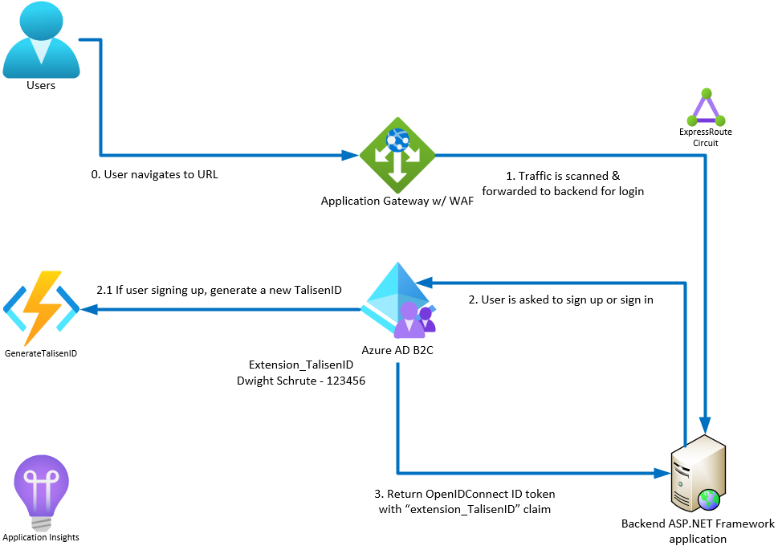

# Azure AD B2C with custom claim & ASP<area>.NET Framework MVC app

This repo includes a sample application & B2C tenant with custom policy to show how to store a custom claim on the user's profile & generate this unique ID the first time a user logs in.

## Disclaimer

**THE SOFTWARE IS PROVIDED "AS IS", WITHOUT WARRANTY OF ANY KIND, EXPRESS OR IMPLIED, INCLUDING BUT NOT LIMITED TO THE WARRANTIES OF MERCHANTABILITY, FITNESS FOR A PARTICULAR PURPOSE AND NONINFRINGEMENT. IN NO EVENT SHALL THE AUTHORS OR COPYRIGHT HOLDERS BE LIABLE FOR ANY CLAIM, DAMAGES OR OTHER LIABILITY, WHETHER IN AN ACTION OF CONTRACT, TORT OR OTHERWISE, ARISING FROM, OUT OF OR IN CONNECTION WITH THE SOFTWARE OR THE USE OR OTHER DEALINGS IN THE SOFTWARE.**

## Architecture



In this example, the backend ASP<area>.NET Framework MVC application expects a **custom claim** to show up to authorize the incoming user. This is a custom claim that was provided by a different identity provider and is used for all authorization on the backend (it uniquely identifies the incoming user). In this case, the backend applications can be only minimally changed, so this custom claim needs to show up in the OpenIDConnect ID token provided by the identity provider.

We can stand up an [Azure B2C tenant](https://docs.microsoft.com/en-us/azure/active-directory-b2c/) to support this. Azure AD B2C allows us to customize the signin experience for the users, support local & social accounts and work in any Azure environment (such as Government cloud).

We need to create a [custom B2C user policy](https://docs.microsoft.com/en-us/azure/active-directory-b2c/custom-policy-overview) that will guide the user through the sign up/sign in process. They will either create a new account if they don't already have one or sign in with their existing account. If they are signing up for the first time, we need to generate the **custom claim** (in this example, it is called the TalisenID to emulate the previous identity provider). We can use an [Azure Function](https://docs.microsoft.com/en-us/azure/azure-functions/) as an inexpensive & always available HTTP call to generate this ID for new users. Once it has been generated, it will always be stored on the user's profile in Azure AD B2C.

We also want to scan all incoming traffic to the backend applications for potential attacks, so we can direct traffic through an [Azure Application Gateway](https://docs.microsoft.com/en-us/azure/application-gateway/overview) with [Web Application Firewall (WAF)](https://docs.microsoft.com/en-us/azure/web-application-firewall/).

Additionally, we can **back-populate** all existing users from the original identity provider using the [Microsoft Graph API](https://docs.microsoft.com/en-us/graph/) & our B2C tenant.

## Structure

The repo is divided into 2 sections.

- **b2c-custom-policy** : The custom B2C policy you will need to upload to an Azure AD B2C tenant
- **DemoWebAppB2CWithCustomClaim** : A dummy ASP.NET Framework MVC app that will redirect the user to sign up/sign in with Azure AD B2C and print the ID token that is received from the identity provider to show the custom claim come through.

## Deployment process

## Azure AD B2C tenant setup

### Create Azure AD B2C tenant

### Create custom user attribute

### Create application registrations to support sign up/sign in, demo web app & back-population script

### Modify custom B2C policy before upload

### Upload custom B2C policy

## Backpopulate existing users

### Get an access token to the Graph API using Postman

### Create an existing user using Postman

## Demo web app configuration

### Modify web.config with B2C tenant values

You will need to modify the following values in the `DemoWebAppB2CWithCustomClaim\DemoWebAppB2CWithCustomClaim\Web.config`.

```xml
<add key="ida:ClientId" value="f6dd5b80-a7f1-47c1-9be2-f67cc06e0760" />
<add key="ida:AADInstance" value="https://b2ctenantusscdemo.b2clogin.com/{0}/{1}/v2.0/.well-known/openid-configuration" />
<add key="ida:SignUpSignInPolicyId" value="B2C_1A_SIGNUP_SIGNIN" />
<add key="ida:EditProfilePolicyId" value="B2C_1A_PROFILEEDIT" />
<add key="ida:ResetPasswordPolicyId" value="B2C_1A_PASSWORDRESET" />
<add key="ida:Domain" value="b2ctenantusscdemo.onmicrosoft.com" />
<add key="ida:PostLogoutRedirectUri" value="https://localhost:44374/" />
<add key="ida:RedirectUri" value="https://localhost:44374/" />
```

- **ida:ClientId** - This is the **application ID** of your demo web app application registration. This can be found in the **Overview** blade for the demo web app app registration in your B2C tenant.
- **ida:AADInstance** - This is the **Azure AD B2C OpenID Connect metadata document** endpoint. It can be found in the **App Registrations** blade in your B2C tenant. Notice that it has placeholders ({0}, {1}). These will be substituted into during the setup of the middleware, one for each custom policy. Therefore, you should only need to modify the first part of the URL with the name of your B2C tenant.
- **ida:SignUpSignInPolicyId** - This is the name of your custom B2C policy for signing in users.
- **ida:EditProfilePolicyId** - This is the name of your custom B2C policy for modifying users profiles.
- **ida:ResetPasswordPolicyId** - This is the name of your custom B2C policy for resetting user's passwords.
- **ida:Domain** - This is the **domain name** of your B2C tenant. It can be found in the **Overview** blade of your B2C tenant.
- **ida:PostLogoutRedirectUri** - This is where users will be redirected to after signout.
- **ida:RedirectUri** - This is where users will be reidrected to after signin.

## References

- https://docs.microsoft.com/en-us/azure/active-directory-b2c/
- https://docs.microsoft.com/en-us/azure/active-directory-b2c/custom-policy-overview
- https://docs.microsoft.com/en-us/azure/azure-functions/
- https://docs.microsoft.com/en-us/azure/application-gateway/overview
- https://docs.microsoft.com/en-us/azure/web-application-firewall/
- https://docs.microsoft.com/en-us/graph/